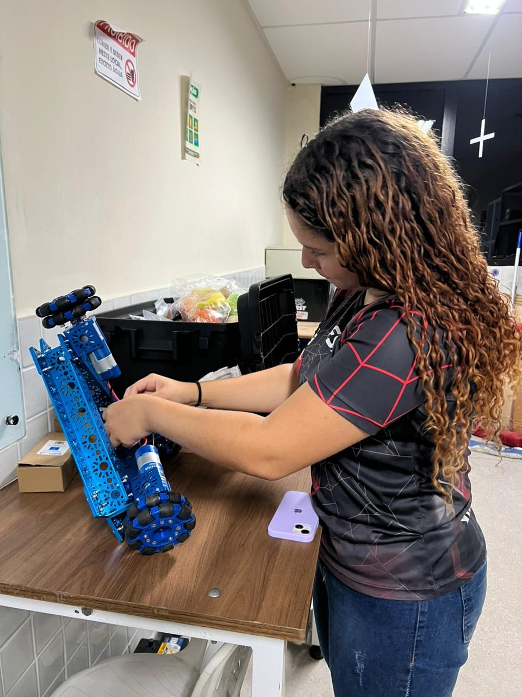

-------------------------------------------------------------------------------
Relatório das Atividades Diárias -> 27/05
-------------------------------------------------------------------------------
Atividades de Fixação, Inventário Técnico e Análise Mecânica: Robótica Móvel (Skill #23)

Este registro detalha as atividades de gerenciamento de hardware do kit industrial,
catalogação sistemática de insumos e auditoria estrutural do robô para a WorldSkills.

-------------------------------------------------------------------------------
📌 Resumo das Atividades do Dia
-------------------------------------------------------------------------------
* Auditoria e Inventário: Desenvolvimento e preenchimento de uma planilha detalhada
  no Excel contendo o levantamento quantitativo e qualitativo de cada item do Kit 
  Studica Lyon 2024.
* Revisão Geral de Hardware: Execução de inspeção visual e análise geométrica estrutural
  diretamente no protótipo robótico para validação de estabilidade mecânica.

-------------------------------------------------------------------------------
📁 Componentes e Sistemas Gerenciados
-------------------------------------------------------------------------------
* `Studica_Kit_Lyon_2024/Mecanica`: Verificação minuciosa de perfis estruturais, 
  chassis, eixos, acoplamentos e elementos de fixação.
* `Controle_Documental/Excel`: Criação de banco de dados técnico para mapeamento 
  patrimonial, controle de sobressalentes e mitigação de perdas de componentes.
* `Analise_Estrutural/Robo`: Avaliação de torque em fixadores, verificação de folgas
  axiais e conferência do alinhamento dos subsistemas mecânicos do robô.

-------------------------------------------------------------------------------
⏳ Evolução e Marcos de Desenvolvimento
-------------------------------------------------------------------------------
* Etapa 1 (Manhã): Triagem física, contagem sistemática e organização taxonômica de 
  todas as peças do Kit Lyon 2024, seguida do lançamento dos dados na planilha Excel.
* Etapa 2 (Tarde): Inspeção física geral no robô (análise do chassi e integridade 
  das peças fixadas), garantindo que a estrutura mecânica suporte os esforços dinâmicos.

-------------------------------------------------------------------------------
✅ Checklist de Validação de Hardware (Casos de Borda)
-------------------------------------------------------------------------------
* Teste Válido (Inventário): Conformidade e rastreabilidade total dos itens da 
  planilha Excel com o estoque físico disponível em bancada.
* Teste de Limite (Mecânica): Verificação de tolerância geométrica dos eixos e folgas, 
  garantindo que o robô mantenha a estabilidade mesmo sob máxima vibração de carga.
* Teste de Borda (Segurança Estrutural): Simulação de estresse mecânico manual nas 
  junções principais, assegurando que nenhum elemento de fixação sofra desalinhamento.

-------------------------------------------------------------------------------
📸 Evidências Fotográficas
-------------------------------------------------------------------------------

===============================================================================
